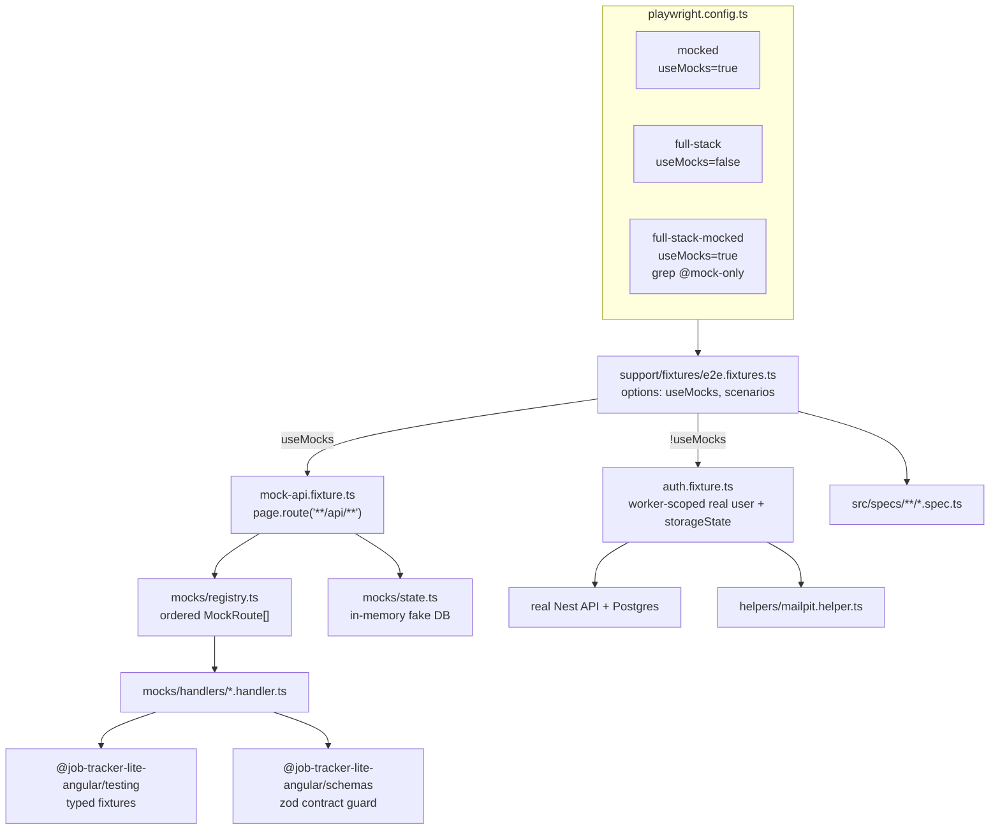

# Hybrid E2E Testing Architecture — `job-tracker-lite-angular`

Status: proposal / plan (nothing implemented yet)
Scope: `apps/frontend-e2e` (Playwright), with supporting changes in `apps/api` and CI
Decision record: [ADR-0003](./adr/0003-hybrid-e2e-testing-architecture.md)

---

## 1. Goals

- **One spec, two runtimes.** The same `*.spec.ts` runs against mocked HTTP (fast, deterministic, no infrastructure) *and* against the real Nest API + Postgres. The spec does not choose; the Playwright project does.
- **Fast inner loop.** A full mocked run needs no Docker, no database, no API process, and finishes in under ~90 s.
- **Contract truth in CI.** The full-stack lane proves the frontend and the real API actually agree.
- **Nothing untestable.** Failure modes a real backend won't produce on demand (500s, malformed bodies, slow responses, rate limits) still get covered — in a dedicated mocked lane that runs inside the same CI pass.
- **Every third-party dependency is swappable.** No test ever reaches a real external service.

### Non-goals

- Replacing unit/component tests. E2E covers flows across screens, not branch coverage.
- Cross-browser matrix. Chromium only until the suite is stable; Firefox/WebKit are a later, cheap addition.

---

## 2. The three-lane model

Three Playwright projects over one `testDir`:

| Project | `useMocks` | Selection | Purpose |
|---|---|---|---|
| `mocked` | `true` | `grepInvert: /@full-stack-only/` | local dev, pre-push, every PR |
| `full-stack` | `false` | `grepInvert: /@mock-only/` | real API + Postgres + Mailpit |
| `full-stack-mocked` | `true` | `grep: /@mock-only/` | failure modes the real backend can't produce |

`nx run frontend-e2e:e2e` runs `full-stack` + `full-stack-mocked` together, so **every test executes exactly once per CI pass**, in the only mode where it is meaningful. Nothing is silently skipped in both lanes.

Lane membership is declared with **Playwright's native tags**, not with substrings in describe titles:

```ts
test.describe('job list — API down', { tag: '@mock-only' }, () => { … });
test('verification email arrives', { tag: '@full-stack-only' }, async () => { … });
```

Untagged tests — the majority — run in both lanes.



---

## 3. Control axes

| Axis | Where it lives | Controls |
|---|---|---|
| **Runtime** — `useMocks` | Playwright project → fixture option | whether request interception is installed at all |
| **Scenarios** — `scenarios` | fixture option, set per `describe` via `test.use({ scenarios: { … } })` | which behaviour each *domain's* handlers exhibit |
| **Routing** | `support/mocks/registry.ts` | ordered `{ method, pattern, resolve }` table |
| **Data** | `@job-tracker-lite-angular/testing` | typed fixtures, shared with unit tests and the Prisma seed |
| **State** | `support/mocks/state.ts` | in-memory store so mocked CRUD behaves like a real backend |

Two rules make one spec viable in two runtimes:

1. **Assertion asymmetry.** Mocked mode asserts exact values (they come from the same fixture the mock served). Full-stack mode asserts *shape* — a row exists, a field is non-empty, an id looks like a cuid. Helpers encode this, specs don't branch on it more than necessary.
2. **Data provisioning is a fixture, not a step.** In mocked mode the store is pre-seeded; in full-stack mode a worker-scoped user is provisioned once and reused. Specs receive data, they don't create it inline.

---

## 4. Repo-specific constraints

These are load-bearing — a design that ignores them will not work here.

- **Playwright must not enter `libs/shared/testing`.** That library is imported by Jest/Vitest unit tests *and* by `libs/shared/prisma/src/seed.ts`. Adding an `@playwright/test` import would drag Playwright into the unit-test and seed graphs. **All Playwright code lives in `apps/frontend-e2e/src/support/`; only plain data fixtures are imported from `@job-tracker-lite-angular/testing`.**
- **Single API prefix.** `app.setGlobalPrefix('api')` in `apps/api/src/main.ts`, plus the dev-server proxy in `apps/frontend/proxy.conf.json`. One `page.route('**/api/**')` covers the entire surface.
- **All traffic is `fetch`.** `provideHttpClient(withFetch())` plus `httpResource` in the data-access services — fully interceptable by `page.route`.
- **Auth is cookie-session via better-auth**, exposed under `/api/auth/*` (`sign-in/email`, `sign-up/email`, `get-session`, `sign-out`, …), with origin-based protection through `trustedOrigins` in `apps/api/src/app/auth/auth.config.factory.ts`. There is **no CSRF token layer** in the request path, and no client-side token store — so:
  - mocked mode fakes **`GET /api/auth/get-session`**, and `sessionInitGuard` / `authGuard` / `guestGuard` pass naturally. No `localStorage` seeding, no `addInitScript` tricks.
  - full-stack mode provisions via Playwright's `APIRequestContext` and carries the session in `storageState`. No in-browser `fetch` dance is required.
  - *If* a CSRF scheme is added later, provisioning has to move into the browser context so the cookie jar matches; that is the one part of this design that would need revisiting.
- **All domain data is user-scoped** in the Prisma schema (jobs, contacts, notes, profile, preferences). One provisioned user per Playwright worker therefore gives real isolation, which is what lets the full-stack lane run `fullyParallel: true`.
- **CI starts the dev servers outside Nx**, and `apps/frontend-e2e/project.json` sets `dependsOn: []`. This works around a real nested-Nx deadlock (the daemon is disabled when `CI=true`). It is documented in three places and must not be undone; new targets have to respect it.
- **`data-testid` is inconsistent today** — ~30 attributes mixing kebab-case (`save-skills-btn`) and camelCase (`saveStateIndicator`). Standardise on kebab-case and set `testIdAttribute: 'data-testid'` so specs can use `getByTestId` instead of structural CSS.

---

## 5. File layout

```
apps/frontend-e2e/
├─ playwright.config.ts              # 3 projects, testIdAttribute, conditional webServer
├─ project.json                      # targets: e2e (full-stack), e2e-mocked, typecheck
└─ src/
   ├─ support/
   │  ├─ scenarios.ts                # per-domain scenario unions + ScenarioMap + defaults
   │  ├─ fixtures/
   │  │  ├─ e2e.fixtures.ts          # THE entry point: export { test, expect }
   │  │  ├─ mock-api.fixture.ts      # route table install + request recorder
   │  │  └─ auth.fixture.ts          # worker-scoped user (full-stack) / session mock (mocked)
   │  ├─ mocks/
   │  │  ├─ registry.ts              # ordered MockRoute[]
   │  │  ├─ state.ts                 # in-memory fake DB, seeded from shared fixtures
   │  │  ├─ contract.ts              # zod validation of mock responses
   │  │  └─ handlers/
   │  │     ├─ auth.handler.ts       # get-session, sign-in, sign-up, sign-out, reset, verify
   │  │     ├─ jobs.handler.ts       # CRUD + status
   │  │     ├─ contacts.handler.ts
   │  │     ├─ notes.handler.ts
   │  │     ├─ profile.handler.ts
   │  │     ├─ preferences.handler.ts
   │  │     ├─ account.handler.ts    # change-email, delete/request, export-data
   │  │     └─ health.handler.ts
   │  └─ helpers/
   │     ├─ api.helper.ts            # real-backend provisioning + cleanup (full-stack)
   │     ├─ mailpit.helper.ts        # waitForEmail / extractLink / purge
   │     ├─ nav.helper.ts
   │     └─ pages/                   # thin page objects: locators only, no assertions
   └─ specs/
      ├─ smoke.spec.ts
      ├─ auth/{login,register,logout,forgot-password,verify-email}.spec.ts
      ├─ jobs/{job-list,job-crud,job-status,job-detail}.spec.ts
      ├─ jobs/{contacts,notes}.spec.ts
      ├─ profile/{personal-info,skills,visibility}.spec.ts
      ├─ settings/{preferences,account,privacy}.spec.ts
      └─ status.spec.ts
```

Specs import from **exactly one** module: `support/fixtures/e2e.fixtures.ts`. Everything else is internal.

---

## 6. Scenarios

`apps/frontend-e2e/src/support/scenarios.ts`:

```ts
export type BaseScenario =
  | 'happyPath'    // 2xx, representative data
  | 'noData'       // 2xx, empty list / null detail
  | 'serverError'  // 500
  | 'loading';     // delayed response, unresolved within the assertion window

export type AuthScenario =
  | BaseScenario
  | 'unauthenticated'     // get-session -> null
  | 'invalidCredentials'  // 401
  | 'unverifiedEmail'     // 403 EMAIL_NOT_VERIFIED
  | 'emailTaken'          // 409 on sign-up
  | 'rateLimited';        // 429

export type JobsScenario        = BaseScenario | 'notFound' | 'validationError';
export type ContactsScenario    = BaseScenario | 'notFound';
export type NotesScenario       = BaseScenario | 'notFound';
export type ProfileScenario     = BaseScenario | 'partiallyFilled';
export type PreferencesScenario = BaseScenario;
export type AccountScenario     = BaseScenario | 'changeEmailCooldown' | 'deletionPending';
export type HealthScenario      = 'happyPath' | 'degraded' | 'serverError';

export interface ScenarioMap {
  auth: AuthScenario;
  jobs: JobsScenario;
  contacts: ContactsScenario;
  notes: NotesScenario;
  profile: ProfileScenario;
  preferences: PreferencesScenario;
  account: AccountScenario;
  health: HealthScenario;
}

export const defaultScenarios: ScenarioMap = {
  auth: 'happyPath', jobs: 'happyPath', contacts: 'happyPath', notes: 'happyPath',
  profile: 'happyPath', preferences: 'happyPath', account: 'happyPath', health: 'happyPath',
};
```

**Scenarios are per-domain, not global.** A partial override is merged over the defaults by the fixture, so one test can have a failing jobs API while auth still succeeds:

```ts
test.describe('job list — API down', { tag: '@mock-only' }, () => {
  test.use({ scenarios: { jobs: 'serverError' } });   // auth stays happyPath
  …
});
```

A single global scenario string would force a test split for every combination — this is worth the small extra type surface.

---

## 7. The mock layer

### 7.1 Route table

Ordered, method-aware, regex over `pathname` — **not** substring matching over an unordered map, which would let `/api/jobs` swallow `/api/jobs/:id/notes` and make `GET` indistinguishable from `DELETE`.

```ts
export type HttpMethod = 'GET' | 'POST' | 'PATCH' | 'PUT' | 'DELETE';

export interface MockContext {
  scenarios: ScenarioMap;
  state: MockState;
  method: HttpMethod;
  url: URL;
  params: Record<string, string>;   // from named regex groups
  body: unknown;                     // parsed JSON request body
}

export interface MockResponse { status: number; body?: unknown; delayMs?: number; }

export interface MockRoute {
  method: HttpMethod | HttpMethod[];
  pattern: RegExp;                   // e.g. /^\/api\/jobs\/(?<id>[^/]+)\/status$/
  resolve: (ctx: MockContext) => MockResponse | Promise<MockResponse>;
}

// ORDER MATTERS — most specific first.
export const mockRoutes: MockRoute[] = [
  ...authRoutes, ...jobsRoutes, ...contactsRoutes, ...notesRoutes,
  ...profileRoutes, ...preferencesRoutes, ...accountRoutes, ...healthRoutes,
];
```

### 7.2 Interception

```ts
await page.route('**/api/**', async (route) => {
  const req = route.request();
  const url = new URL(req.url());
  const method = req.method() as HttpMethod;

  for (const r of mockRoutes) {
    const methods = Array.isArray(r.method) ? r.method : [r.method];
    if (!methods.includes(method)) continue;
    const m = r.pattern.exec(url.pathname);
    if (!m) continue;

    const body = safeJson(req.postData());
    recorded.push({ method, path: url.pathname, body });        // exposed as mockApi.requests

    const res = await r.resolve({ scenarios, state, method, url, params: m.groups ?? {}, body });
    if (res.delayMs) await new Promise((done) => setTimeout(done, res.delayMs));

    assertMatchesContract(url.pathname, method, res);            // zod guard, see 7.4
    return route.fulfill({
      status: res.status,
      contentType: 'application/json',
      body: JSON.stringify(res.body ?? {}),
    });
  }

  return route.continue();                                       // unmocked → real API
});
```

Two properties worth keeping:

- **Passthrough fallback.** An unregistered endpoint still reaches the real backend, so "hybrid" works at request granularity, not only per-project. Useful when adding a feature: mock the new endpoint, leave the rest real.
- **Request recording.** `mockApi.requests` lets a test assert *what the app sent*, not just what it rendered — e.g. that a status change issued `PATCH /api/jobs/:id/status` with the right body.

### 7.3 Stateful store

Created fresh per test, seeded from the shared fixtures:

```ts
export function createMockState(scenarios: ScenarioMap): MockState {
  return {
    session: scenarios.auth === 'unauthenticated' ? null : authSessionFixtures.verifiedUser,
    jobs: scenarios.jobs === 'noData' ? [] : structuredClone(allJobDtoFixtures),
    contacts: …, notes: …, profile: …, preferences: …,
  };
}
```

Handlers mutate it:

```ts
export const jobsRoutes: MockRoute[] = [
  { method: 'GET', pattern: /^\/api\/jobs$/, resolve: ({ state, scenarios }) =>
      scenarios.jobs === 'serverError'
        ? { status: 500, body: serverErrorFixture }
        : { status: 200, body: state.jobs } },

  { method: 'POST', pattern: /^\/api\/jobs$/, resolve: ({ state, body }) => {
      const created = { ...(body as CreateJobDto), id: nextId(), status: 'SAVED',
                        createdAt: jobFixtureTimestamp, updatedAt: jobFixtureTimestamp };
      state.jobs.unshift(created);
      return { status: 201, body: created };
  } },

  { method: 'PATCH',  pattern: /^\/api\/jobs\/(?<id>[^/]+)\/status$/, resolve: … },
  { method: 'PATCH',  pattern: /^\/api\/jobs\/(?<id>[^/]+)$/,         resolve: … },
  { method: 'DELETE', pattern: /^\/api\/jobs\/(?<id>[^/]+)$/,         resolve: … },
  { method: 'GET',    pattern: /^\/api\/jobs\/(?<id>[^/]+)$/, resolve: ({ state, params, scenarios }) =>
      scenarios.jobs === 'notFound' ? { status: 404, body: notFoundFixture } : … },
];
```

**This is the highest-value part of the design.** Stateless mocks (pure `(endpoint, scenario) → response`) can only test read-only screens: `POST /api/jobs` followed by `GET /api/jobs` would return the stale list, so create/edit/delete flows stay untestable without a backend. With a store, `create → list shows it → change status → delete` is a single mocked test running in ~2 s.

### 7.4 Contract guard

`libs/shared/schemas` already exports zod schemas for every DTO. Before fulfilling, the mock body is validated against the schema for that route:

```ts
const result = schemaFor(path, method)?.safeParse(res.body);
if (result && !result.success) {
  throw new Error(`Mock response for ${method} ${path} violates its schema:\n${z.prettifyError(result.error)}`);
}
```

A DTO change that outdates a mock then fails the mocked lane **with a readable schema error**, instead of producing a green-but-wrong test or a mysterious UI assertion failure three screens later. This is the reason to build mocks from typed fixtures rather than JSON blobs — untyped fixtures cast with `as unknown as` drift silently.

---

## 8. Auth fixture — the two lanes

```ts
export const test = base.extend<E2EOptions & E2EFixtures, WorkerFixtures>({
  useMocks:  [false,            { option: true }],
  scenarios: [defaultScenarios, { option: true }],

  // full-stack: one real user per worker, provisioned once, reused via storageState
  workerUser: [async ({ browser, useMocks }, use, workerInfo) => {
    if (useMocks) { await use(null); return; }

    const ctx = await browser.newContext();
    const api = ctx.request;
    const user = await provisionUser(api, `w${workerInfo.workerIndex}`);   // sign-up + verify via Mailpit
    const storageState = await ctx.storageState();
    await ctx.close();

    await use({ ...user, storageState });
    await deleteUser(user);                                                // teardown
  }, { scope: 'worker' }],

  storageState: async ({ workerUser }, use) => use(workerUser?.storageState ?? undefined),

  page: async ({ page, useMocks, scenarios, mockApi }, use) => { … },
});
```

- **Per-worker users make the full-stack lane parallel-safe.** All domain rows are user-scoped, so two workers never touch the same data — no `workers: 1` serialisation, no cross-test leakage, no reliance on cleanup ordering.
- **`storageState` avoids re-authenticating per test**, which is otherwise the single largest cost in the full-stack lane.
- Tests that must start unauthenticated (login, register, guest-guard redirects) opt out with `test.use({ storageState: undefined })`.
- **Cleanup lives in exactly one place** — the fixture teardown, plus a per-test tracker for entities created mid-test. No spec constructs its own delete call; duplicated cleanup logic diverges the moment one copy is fixed.

---

## 9. Third-party and hard-to-test surfaces

Two rules govern every dependency.

**Rule 1 — ownership decides real-vs-fake.** Infrastructure *we* run (Postgres, Redis, the SMTP catcher) runs for real, as a container, in every lane that has a backend at all. Only services a *vendor* runs (Resend today, any future external API) get substituted. Faking infrastructure we own does not reduce risk, it hides it: the existing `QUEUE_DRIVER=memory` fake in `queue.module.ts` returns `{ id: 'memory-job' }` and drops the job, so an e2e test for "register → verification email arrives" would pass while nothing was ever processed.

**Rule 2 — substitute from outside the process, never by in-process patching.** In the full-stack lane the API is a separate OS process; `jest.mock`, `nock` and `msw/node` in the test runner cannot reach it. Only two levers cross that boundary: an env-selected DI provider (the `EmailProviderFactory` pattern) and an env-configurable base URL pointed at a stub. **Every third-party client must expose both, or it cannot be tested end to end.**

| Surface | Today | E2E strategy |
|---|---|---|
| **Email** (Resend / SMTP) | `EmailProviderFactory` with `resend` \| `mailtrap` \| `mailpit`, selected by `EMAIL_PROVIDER` | ✅ already swappable. Full-stack: `EMAIL_PROVIDER=mailpit`, assert and extract links through Mailpit's REST API. Mocked: handler returns 2xx, spec asserts the UI notice only |
| **better-auth session** | cookies under `/api/auth/*` | Mocked: fake `GET /api/auth/get-session`. Full-stack: real cookies in `storageState` |
| **Redis / BullMQ** | `QueueModule` + `queue.config.factory`; a `QUEUE_DRIVER=memory` fake already exists | **We own it → run it.** Real Redis container in every backend lane, isolated per worker by BullMQ `prefix`. The memory fake is scoped to API unit tests only and must never be set in an e2e run |
| **Postgres** | Prisma | **We own it → run it.** Real Postgres container; database-per-worker cloned from a migrated template. `TEST_DATABASE_URL` / `TEST_DB_NAME` / `TEST_DB_PORT` already exist in `.env.example` for exactly this |
| **Healthcheck** (`@nestjs/axios` in `HealthcheckModule`) | outbound HTTP probe | Mocked: `health.handler.ts`. Full-stack: leave real; pin the `degraded` case to `@mock-only` |
| **Time / dates** | `Date.now()` in date-format rendering and relative dates | `page.clock.install({ time: jobFixtureTimestamp })` in the fixture, so "2 days ago" and the date-format preference are assertable |
| **Browser APIs** | `matchMedia` (theme), `localStorage` (preferences, cookie consent) | `emulateMedia({ colorScheme })` + `addInitScript` |
| **Anything else external** | — | Backstop: `page.route(/^https?:\/\/(?!localhost)/, r => r.abort())` in mocked mode, so an accidental real outbound call **fails the test** instead of flaking |

### 9.1 Where each double lives

A dependency does not have *a* mock — it has one per layer. Empty cells are structural, not gaps.

| Layer | Postgres | Redis / BullMQ | Mail | 3rd-party HTTP |
|---|---|---|---|---|
| Frontend unit / component | — | — | — | — |
| Frontend e2e `mocked` | — | — | — | — |
| API unit (`TestingModule`) | `prisma-service.mock` | queue-token fake (`QUEUE_DRIVER`) | `email-service.mock` | client mock |
| API integration (in-process) | **real, Docker** — tx rollback per test | **real, Docker** | **Mailpit** | in-process stub acceptable |
| Full-stack e2e (black box) | **real, Docker** — db per worker | **real, Docker** — prefix per worker | **Mailpit** | **stub container**, env-pointed |

The first two rows are empty deliberately: in the frontend mocked lane there is no API process, so there is nothing for a database or queue double to attach to — `page.route` already subsumes everything below the HTTP boundary. Database and queue doubles are an API-layer concern. The corollary is that the mocked lane structurally cannot catch persistence or queue bugs, which is why untagged tests also run in the full-stack lane.

### 9.2 Test stack and worker isolation

A `docker-compose.test.yml` overlay runs the owned services on test-only ports so the dev stack can stay up alongside it. CI uses service containers instead of the overlay.

- **Postgres — database per worker, cloned from a migrated template.** `CREATE DATABASE jt_e2e_w0 TEMPLATE jt_e2e_tpl` clones in roughly 100 ms, giving full isolation with one migration run per CI job.

  Transaction-rollback-per-test is **not available at this layer**: the HTTP request runs on the API process's own connection pool, so the test holds no handle on that transaction. Rollback stays an API-integration technique.
- **Redis — one container, a BullMQ `prefix` per worker** (`{e2e-w0}`). Cleaner than juggling logical database indices, and supported natively by BullMQ.
- **Mailpit — one instance**, isolated by unique per-worker recipient addresses.

### 9.3 Third-party stub

Third parties are substituted with a small in-repo Express app (`apps/thirdparty-stub`) rather than WireMock: it is one more Nx target instead of a new tool, and it can carry a control endpoint —

```
POST /__control/scenario  { "resend": "rateLimited" }
```

— so the full-stack lane can drive vendor failure modes (429, timeout, malformed response) instead of only happy paths. Each third-party client's base URL is pointed at it by env.

Nothing needs the stub today: `EMAIL_PROVIDER=mailpit` sidesteps Resend entirely, and the Resend provider is covered at the unit layer with a stubbed client. The stub earns its keep the moment a real outbound integration lands — but the env-configurable base URL requirement applies from the first one.

### 9.4 Queue driver, corrected

`QUEUE_DRIVER` currently collapses two different needs onto one fake that drops the job. Split them, and scope both to API unit tests:

- `inline` — **execute** the processor synchronously, so the effect is assertable
- `memory` — **record** enqueued jobs for `expect(queue.added).toContainEqual(…)`

Neither value may be set in an e2e run; the full-stack lane always uses real Redis.

### Mailpit helper

`docker-compose.yml` already runs Mailpit (SMTP 1025, UI/API 8025) and the API already has a Mailpit provider. Its REST API turns verify-email, reset-password and change-email into fully assertable full-stack flows — currently the app's highest-value uncovered area. CI today points `SMTP_*` at `smtp.ethereal.email`; that should become a Mailpit service container.

```ts
const MAILPIT = process.env.MAILPIT_API ?? 'http://localhost:8025/api/v1';

export async function waitForEmail(api: APIRequestContext, to: string, subject: RegExp, timeout = 15_000) {
  const deadline = Date.now() + timeout;
  while (Date.now() < deadline) {
    const res = await api.get(`${MAILPIT}/search?query=${encodeURIComponent(`to:${to}`)}`);
    const { messages } = await res.json();
    const hit = messages?.find((m) => subject.test(m.Subject));
    if (hit) return api.get(`${MAILPIT}/message/${hit.ID}`).then((r) => r.json());
    await new Promise((r) => setTimeout(r, 300));
  }
  throw new Error(`No email to ${to} matching ${subject} within ${timeout}ms`);
}

export const extractLink = (html: string, path: string) =>
  html.match(new RegExp(`https?://[^\\s"']*${path}[^\\s"']*`))?.[0];

export const purgeInbox = (api: APIRequestContext) => api.delete(`${MAILPIT}/messages`);
```

Each worker's user has a unique address (`w0+e2e-…@example.test`), so `to:` search keeps workers from reading each other's mail.

---

## 10. Playwright config and Nx targets

```ts
export interface E2EOptions { useMocks: boolean; scenarios: Partial<ScenarioMap>; }

export default defineConfig<E2EOptions>({
  testDir: './src/specs',
  timeout: 60_000,
  expect: { timeout: 10_000 },
  fullyParallel: true,
  forbidOnly: !!process.env.CI,
  retries: process.env.CI ? 2 : 0,
  use: {
    baseURL: process.env.BASE_URL ?? 'http://localhost:4200',
    testIdAttribute: 'data-testid',
    trace: 'retain-on-failure',
    screenshot: 'only-on-failure',
    video: 'retain-on-failure',
    useMocks: false,
    scenarios: {},
  },
  reporter: process.env.CI
    ? [['list'], ['blob'], ['junit', { outputFile: '../../dist/.playwright/junit.xml' }]]
    : 'list',
  projects: [
    { name: 'mocked',            use: { ...devices['Desktop Chrome'], useMocks: true },
      grepInvert: /@full-stack-only/ },
    { name: 'full-stack',        use: { ...devices['Desktop Chrome'], useMocks: false, actionTimeout: 10_000 },
      grepInvert: /@mock-only/ },
    { name: 'full-stack-mocked', use: { ...devices['Desktop Chrome'], useMocks: true, actionTimeout: 10_000 },
      grep: /@mock-only/ },
  ],
  // Only the full-stack lane needs the API. Keep reuseExistingServer:true and the
  // CI-starts-servers-outside-Nx arrangement — see project.json and .github/workflows/ci.yml.
  webServer: process.env.E2E_MOCKED === 'true' ? [frontendServer] : [apiServer, frontendServer],
});
```

`apps/frontend-e2e/project.json`:

```jsonc
"e2e":        { /* existing — runs full-stack + full-stack-mocked */ },
"e2e-mocked": {
  "executor": "nx:run-commands",
  "options": {
    "command": "npx playwright test -c apps/frontend-e2e/playwright.config.ts --project=mocked",
    "env": { "E2E_MOCKED": "true" }
  }
}
```

`e2e-mocked` needs neither Postgres nor the API process — it is the pre-push and watch-mode lane.

---

## 11. Scenario catalogue

Legend: **M** = mocked lane, **F** = full-stack lane, **M!** = `@mock-only`, **F!** = `@full-stack-only`.

**Smoke** — M F
- app boots, `<app-root>` visible, no `NullInjectorError` in the console
- `/status` renders Health Check
- unknown route redirects to `/`

**Auth**
- login happy path → redirected off `/auth/login`, session established — M F
- invalid credentials → error message, stays on page — M F
- client-side validation on an empty form — M
- unverified email → verify-email-notice — M, F!
- register happy path → notice screen — M F
- register with an existing email → 409 message — M F
- register 500 — M!
- logout → guest UI restored — M F
- `guestGuard`: authenticated user hitting `/auth/login` is redirected — M F
- `authGuard`: anonymous user hitting `/jobs` is redirected — M F
- forgot password → email arrives → reset link → new password → login with it — F!
- verify-email link from Mailpit → verified state — F!
- reset with an expired/invalid token — M!

**Jobs**
- list renders N cards from fixtures — M F
- empty state — M (`jobs: 'noData'`), F (fresh worker user)
- loading skeleton visible, then resolves — M!
- 500 → error state — M!
- create job → appears in list — M F
- edit job → values persist after reload — M F
- change status (SAVED → APPLIED → INTERVIEW → …) → badge updates — M F
- delete job, including the confirm dialog — M F
- detail of an unknown id → not-found state — M! F
- zod validation errors surfaced on create — M F

**Contacts / Notes** (tabs under a job)
- list, create, edit, delete for each — M F
- empty state per tab — M
- note body character counter (`data-testid="characters-left"`) — M

**Profile**
- personal info edit + save-state indicator — M F
- skill manager add / save / discard — M F
- granular visibility increase/decrease + label text — M F
- public profiles list on home reflects visibility — M F!

**Settings / preferences**
- theme dark/light applies to `<html class>` — M F
- language switch re-renders translated strings — M F
- date format preference changes rendered dates (with `page.clock`) — M
- **persistence after reload** — keep the existing regression spec — M F

**Privacy / account**
- cookie consent banner accept/decline persists — M F
- cookie and privacy policy dialogs open/close — M
- change email → cooldown message on rapid re-request — M (`account: 'changeEmailCooldown'`), F!
- change email → confirm link from Mailpit → email updated — F!
- change password → old password rejected afterwards — F!
- account deletion request → pending screen → recover — M F
- data export downloads a file — M F
- cleanup-period slider submit — M

---

## 12. Design decisions worth stating explicitly

| Decision | Alternative rejected | Why |
|---|---|---|
| Typed fixtures from `@job-tracker-lite-angular/testing` + zod validation | JSON data files | JSON needs `as unknown as` casts; mocks then drift from DTOs silently. The typed path also shares one source with unit tests and the Prisma seed |
| Ordered, method-aware route table | substring match over an unordered object | `/api/jobs` collides with `/api/jobs/:id/notes`; `GET` and `DELETE` on one path are indistinguishable; insertion order decides winners |
| Per-domain `ScenarioMap` | single global scenario string | can't express "jobs fail, auth succeeds"; forces a test split per combination |
| Stateful in-memory store | pure `(endpoint, scenario) → response` | stateless mocks make all create/update/delete flows untestable without a backend |
| Playwright native tags | `[mock-only]` substring in describe titles | titles get reworded; substrings are brittle and unsearchable |
| Worker-scoped user + `storageState` | shared fixed test user, `workers: 1` | user-scoped data makes per-worker users fully isolated → real parallelism, no rate-limit serialisation |
| `getByTestId` / `getByRole` | structural CSS (`app-foo[name="x"] input`) | component refactors break structural selectors; e2e should assert behaviour, not DOM shape |
| Request recording in the mock fixture | assert on rendered output only | lets a spec verify the outgoing payload, catching "renders fine, sends wrong body" bugs |

---

## 13. Phased rollout

| Phase | Deliverable | Est. |
|---|---|---|
| **0** | `support/` skeleton, `scenarios.ts`, config with 3 projects, `e2e-mocked` Nx target, `testIdAttribute`, outbound backstop. Move `smoke.spec.ts` and the existing `preferences-persistence.spec.ts` onto the new `test` export with behaviour unchanged. | 0.5 d |
| **1** | `mock-api.fixture` + registry + `state.ts` + `auth.handler` + `jobs.handler` + contract guard. Jobs list/CRUD/status specs, mocked lane only. | 1.5 d |
| **2** | Full-stack lane: `api.helper` provisioning, worker-scoped user, `storageState`, cleanup registry. Run the phase-1 specs in full-stack and resolve the assertion asymmetries. Enable `fullyParallel`. | 1.5 d |
| **3** | `docker-compose.test.yml` overlay (Postgres, Redis, Mailpit on test ports), template-database provisioning, per-worker BullMQ prefix, Mailpit helper. Email flows: verify-email, forgot/reset password, change-email. Add the Redis and Mailpit services to CI. Split `QUEUE_DRIVER` into `inline` / `memory` and scope both to unit tests. | 1.5 d |
| **4** | Remaining handlers and specs: contacts, notes, profile, preferences, account, privacy. `data-testid` sweep and kebab-case normalisation. | 2–3 d |
| **5** | CI split, blob-report merge, `docs/e2e.md` conventions guide + PR checklist, flake policy. | 0.5 d |

Phases 0–2 are load-bearing; 3–5 are additive and can land independently.

---

## 14. CI shape

```yaml
# every PR — fast, no infrastructure
- run: npx nx run frontend-e2e:e2e-mocked

# main / nightly — full lane, every owned service real
services:
  postgres: …          # already present
  redis:
    image: redis:7-alpine
    ports: ['6379:6379']
    options: >-
      --health-cmd "redis-cli ping" --health-interval 10s
      --health-timeout 5s --health-retries 5
  mailpit:
    image: axllent/mailpit:latest
    ports: ['1025:1025', '8025:8025']
env:
  EMAIL_PROVIDER: mailpit          # the SMTP catcher we own — not a mock of one
  MAILPIT_HOST: localhost
  MAILPIT_PORT: 1025
  REDIS_HOST: localhost
  REDIS_PORT: 6379
  # QUEUE_DRIVER is deliberately unset: the full-stack lane always uses real Redis.
- run: npx nx run frontend-e2e:e2e     # full-stack + full-stack-mocked
```

Keep the existing "start dev servers outside Nx, `dependsOn: []`" arrangement — it exists to avoid a real nested-Nx deadlock in CI.

---

## 15. Definition of done

- `nx run frontend-e2e:e2e-mocked` is green with no Docker, no Postgres and no API process, in under ~90 s.
- `nx run frontend-e2e:e2e` is green against a real API + Postgres + Mailpit, with `fullyParallel: true`.
- Every spec runs in exactly one lane per CI pass; no test is silently skipped in both.
- A DTO change that outdates a mock fails the mocked lane with a zod schema error.
- No spec constructs its own provisioning, fetch or cleanup logic — all of it lives in `support/`.
- Specs select elements via `getByTestId` / `getByRole`, not structural CSS.
- `docs/e2e.md` documents the conventions and the PR checklist.

---

## 16. PR checklist for new e2e tests

- [ ] Uses the shared fixtures; no copy-pasted selectors or ad-hoc `fetch` calls
- [ ] Correctly tagged (`@mock-only` / `@full-stack-only`) or intentionally untagged for both lanes
- [ ] Mock responses come from typed fixtures and pass the contract guard
- [ ] Any entity created mid-test is registered for cleanup
- [ ] No dependency on another test's side effects
- [ ] No fixed `waitForTimeout`; uses web-first assertions
- [ ] New UI touched by the test carries a kebab-case `data-testid`
